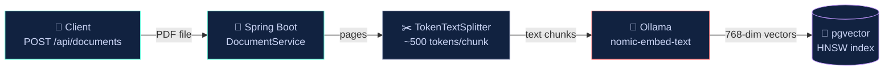
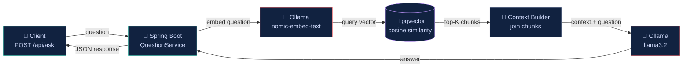
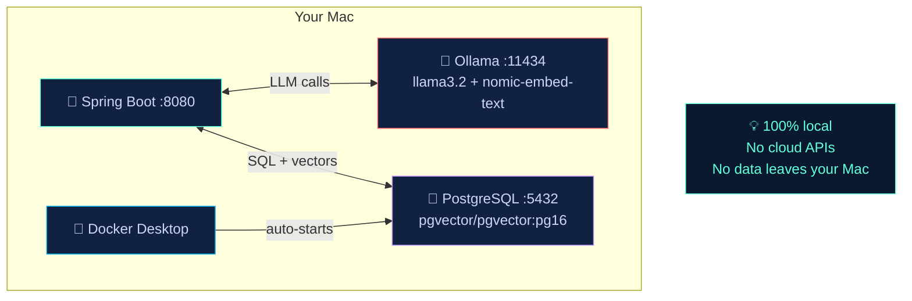

## Architecture

### Ingestion Flow (PDF → Vector Store)

```mermaid
flowchart LR
    A[👤 Client\nPOST /api/documents] -->|PDF file| B[🍃 Spring Boot\nDocumentService]
    B -->|pages| C[✂️ TokenTextSplitter\n~500 tokens/chunk]
    C -->|text chunks| D[🦙 Ollama\nnomic-embed-text]
    D -->|768-dim vectors| E[(🐘 pgvector\nHNSW index)]

    style A fill:#112240,stroke:#64ffda,color:#ccd6f6
    style B fill:#112240,stroke:#64ffda,color:#ccd6f6
    style C fill:#112240,stroke:#8892b0,color:#ccd6f6
    style D fill:#112240,stroke:#ff6b6b,color:#ccd6f6
    style E fill:#112240,stroke:#bd93f9,color:#ccd6f6
```

### Query Flow (Question → Answer)

```mermaid
flowchart LR
    A[👤 Client\nPOST /api/ask] -->|question| B[🍃 Spring Boot\nQuestionService]
    B -->|embed question| C[🦙 Ollama\nnomic-embed-text]
    C -->|query vector| D[(🐘 pgvector\ncosine similarity)]
    D -->|top-K chunks| E[📝 Context Builder\njoin chunks]
    E -->|context + question| F[🦙 Ollama\nllama3.2]
    F -->|answer| B
    B -->|JSON response| A

    style A fill:#112240,stroke:#64ffda,color:#ccd6f6
    style B fill:#112240,stroke:#64ffda,color:#ccd6f6
    style C fill:#112240,stroke:#ff6b6b,color:#ccd6f6
    style D fill:#112240,stroke:#bd93f9,color:#ccd6f6
    style E fill:#112240,stroke:#8892b0,color:#ccd6f6
    style F fill:#112240,stroke:#ff6b6b,color:#ccd6f6
```

### Infrastructure

```mermaid
graph TB
    subgraph Your Mac
        A[🍃 Spring Boot :8080]
        B[🦙 Ollama :11434\nllama3.2 + nomic-embed-text]
        C[🐳 Docker Desktop]
        D[🐘 PostgreSQL :5432\npgvector/pgvector:pg16]
    end

    A <-->|LLM calls| B
    A <-->|SQL + vectors| D
    C -->|auto-starts| D

    note[💡 100% local\nNo cloud APIs\nNo data leaves your Mac]

    style A fill:#112240,stroke:#64ffda,color:#ccd6f6
    style B fill:#112240,stroke:#ff6b6b,color:#ccd6f6
    style C fill:#112240,stroke:#0db7ed,color:#ccd6f6
    style D fill:#112240,stroke:#bd93f9,color:#ccd6f6
    style note fill:#0a192f,stroke:#64ffda,color:#64ffda
```