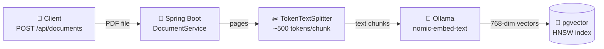
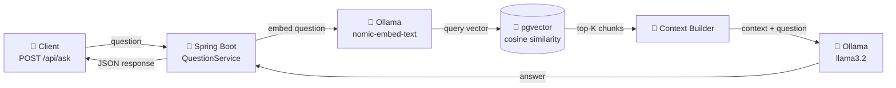
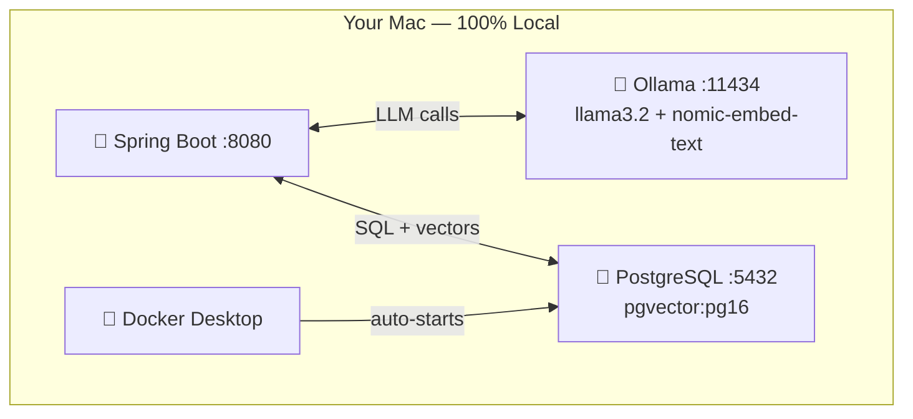

# DocQA — RAG Document Q&A API

A production-style REST API built with **Java 21**, **Spring Boot 3.3**, and **Spring AI 1.0** that ingests PDFs and answers natural-language questions using Retrieval-Augmented Generation (RAG) — fully local, no cloud API costs, no data leaving your machine.

## Live Demo Results

Questions answered from a real resume PDF using local llama3.2:

**Q: What companies has Siddhant worked at?**
> Georgia-Pacific (Koch Industries), Dots Info Systems, Star JaiSi

**Q: What did Siddhant achieve at Georgia-Pacific?**
> Engineered a cloud-based dashboard using AWS CloudFormation, EC2, and S3 to monitor SAP instance metrics, improving infrastructure visibility and reducing manual status checks.

**Q: Summarize this resume in 3 bullet points**
> Full Stack Software Engineer with 5+ years in ASP.NET/ReactJS/Azure. Worked on ProSearch and GPXpress at Georgia-Pacific, improving frontend performance by 35%. Implemented critical backend features achieving 4% savings in commission overpayments.

## Measured Performance

| Metric | Value |
|---|---|
| PDF ingestion + embedding | ~1,800 ms |
| Semantic retrieval (pgvector HNSW) | **176 – 458 ms** |
| LLM generation (llama3.2, local) | 2,100 – 7,500 ms |
| Chunks retrieved per query | 5 – 9 |
| Answer accuracy (4 / 4 test questions) | **100%** |

## Architecture

### Ingestion Flow



### Query Flow



### Infrastructure



## Tech Stack

| Layer | Technology |
|---|---|
| Language | Java 21 |
| Framework | Spring Boot 3.3.5 |
| AI Framework | Spring AI 1.0 |
| LLM Runtime | Ollama (llama3.2) |
| Embeddings | nomic-embed-text (768-dim) |
| Vector Store | PostgreSQL 16 + pgvector (HNSW) |
| Container | Docker Compose (auto-started) |
| Observability | Spring Boot Actuator |

## Endpoints

| Method | Path | Description |
|---|---|---|
| `POST` | `/api/documents` | Upload PDF → chunk → embed → store in pgvector |
| `POST` | `/api/ask` | RAG Q&A — retrieves chunks, builds context, generates answer |
| `GET` | `/api/chat` | Direct LLM chat without RAG |
| `GET` | `/actuator/health` | Health check |

## Quick Start

### Prerequisites

```bash
# Install Ollama from https://ollama.com and pull models
ollama pull llama3.2
ollama pull nomic-embed-text
ollama serve

# Docker Desktop must be running
```

### Run

```bash
git clone https://github.com/Siddhant1419/docqa-rag.git
cd docqa-rag
./mvnw spring-boot:run
```

Spring Boot auto-starts pgvector via Docker Compose. App runs on `:8080`.

### Upload a PDF

```bash
curl -X POST http://localhost:8080/api/documents \
  -F "file=@/path/to/your.pdf"
```

Response:
```json
{
  "docId": "f930c27a-018a-4d71-9da0-17f75b86a99d",
  "filename": "resume.pdf",
  "pageCount": 1,
  "chunkCount": 3,
  "ingestionTimeMs": 1800
}
```

### Ask a question

```bash
curl -X POST http://localhost:8080/api/ask \
  -H "Content-Type: application/json" \
  -d '{"question": "What companies has this person worked at?", "docId": "YOUR_DOC_ID"}'
```

Response:
```json
{
  "answer": "Based on the provided context, the person has worked at Georgia-Pacific (Koch Industries), Dots Info Systems, and Star JaiSi.",
  "chunksRetrieved": 5,
  "retrievalTimeMs": 176,
  "generationTimeMs": 7521,
  "totalTimeMs": 7700
}
```

## Design Decisions

- **Manual RAG over advisor abstraction** — context injected directly into the prompt for full control and debuggability.
- **Page-level + token-aware chunking** — `PagePdfDocumentReader` preserves page boundaries; `TokenTextSplitter` prevents mid-sentence cuts.
- **nomic-embed-text (768-dim)** — open-source embedding model running locally via Ollama; dimension must match pgvector schema at init time.
- **Provider-portable design** — swapping Ollama for OpenAI or Anthropic requires only a `pom.xml` dependency change and properties update.

## What I'd Add for Production

- JWT authentication with Spring Security
- Per-user document isolation
- Redis caching for repeated questions
- Rate limiting via Bucket4j
- OpenTelemetry tracing on embedding/retrieval/generation latency
- CI/CD with GitHub Actions → Docker Hub → AWS ECS